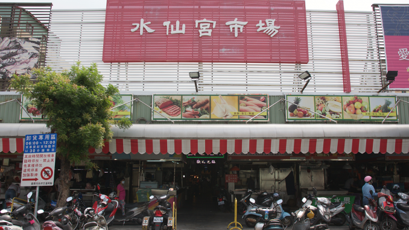
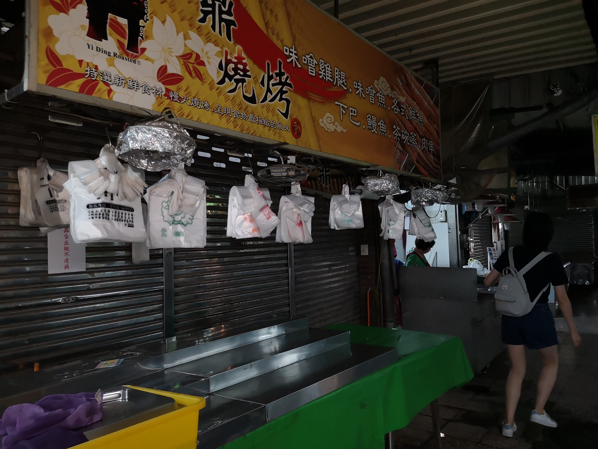
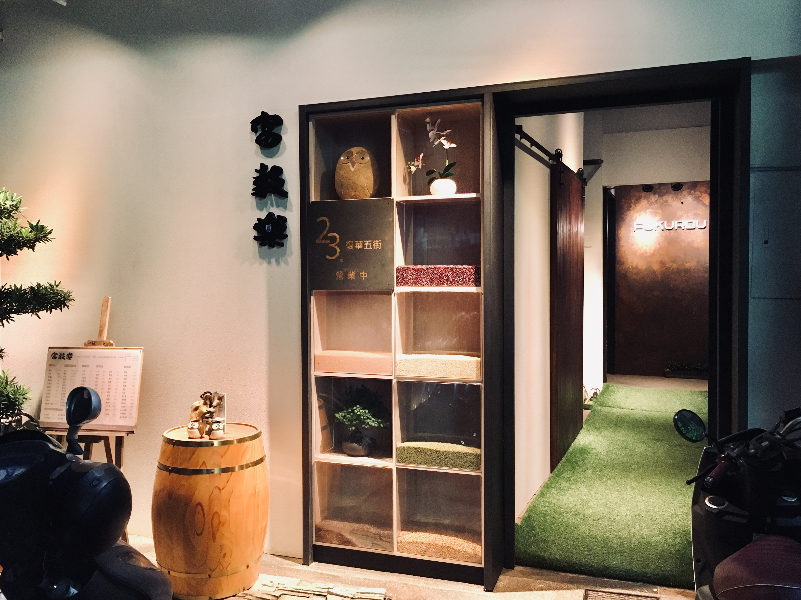
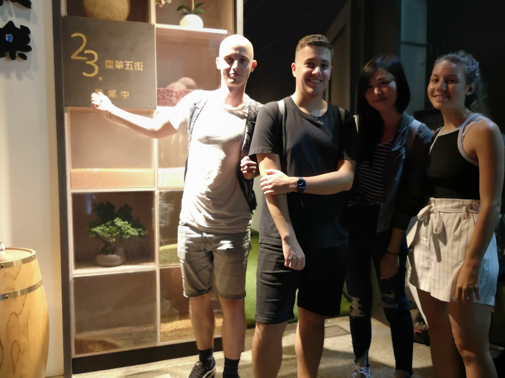

# Creative Waste

As foreign students, plastic packaging waste is one of the issues we realised when we look around Tainan. We see restaurants and sellers giving us plastic whenever we want it, even though it is unnecessary. We always get plastic cups when we drink, one-use chopsticks when we eat, and a new sheet of paper every time when we make our order.

Moreover, Tainan streets are clean in general. We usually see no litter despite the frequency of takeaway food consumption and the lack of trash bins. Yet, we would still come across these scenes from time to time.

'Just because you can't see something doesn't mean it isn't there' - the plastic packaging waste was not disposed on the street but it does not mean there is no waste created. Indeed, this is a serious problem that people in Tainan encounter every day. We therefore decided to work on this topic.

## When, Where and Why?

- *First Visit* - 
We first wanted to observe how plastic packaging waste is made.
Therefore, on 9 October noon, we went to Shuixian Gong Market, one of the most famous morning markets in Tainan with stores of raw food, cooked food and groceries.

- *Second Visit* - 
We then wanted to see how the locals reduce the waste.
Therefore, we picked Fukurou, the first package-free store in the southern part of Taiwan, as the destination. We went there in the evening on 22 October.

## How did we get there?

- By bus (as tourists)
- By bike, scooter and on foot (as locals)

## How did we document the visits?

- Taking photos
- Jotting down notes

## How did we communicate with the locals?

- Chats when purchasing goods at the stores
- Informal interviews with the shopkeepers

<!-- ## How did we combine and compare those two cases

In our first visit, we observed how plastic packaging waste is made in one of the most famous market in Tainan; while in the second one, we saw how the locals try to reduce the waste. -->

## With whom? 

- Local shopkeepers

# First Visit: Shuixian Gong Market

Photo credits: https://blog.tedxtainan.org/2015/09/27/tainan-12/

As Shuixian Gong Market is the food market with the longest history of 300+ years in Tainan, some people already hinted us that mostly elderlies go there to shop. We then took the chance to explore local problems there and talk to the elder locals. We tried to investigate the core issues of all kinds of trash creation at the raw food, cooked food and groceries stores.

The problem of plastic packaging waste is expectedly serious in stores of Shuixian Gong Market. Plastic cups and paper boxes are provided to the customers, even when they are simply dining in. Numerous plastic bags are also provided to separate each kind of takeaway food.

# Second Visit: Fukurou

Fukurou is said to be the first package-free store in Tainan, that we expected to see something completely different from Shuixian Gong Market. We wanted to investigate the feasibility of adopting a zero waste lifestyle here, and also the limitations of running a package-free business. 
 

We talked to the shopkeeper, Lin Pei-chun when we tried to make a purchase in store. She introduced us the grains she sells as well as how they run the business.

Besides, We spent some time observing the neighbourhood. We found the location of Fukurou interesting, as it is hidden in a quiet district that seemed to attract less customers. Lin said they chose this location in order to only attract customers with the habit of intentionally bringing their own containers to shop, instead of those who only come to site-see or take photos.

# What's next?

The two visits brought us new points of view and inspired us a lot. We are now forming a bigger picture of the plastic packaging waste issue, including how habits of the locals create the waste and how some of them are trying to resolve it.

As the existence of morning and night markets is one of the characteristics of Taiwan, which at the same time created the most plastic packaging waste, we are considering to focus more on morning and night markets in the future.

We would like to try achieving the Sustainable Development Goals (SDGs) of creating responsible consumption and production habit, and thus a sustainable city and community.

Logo credits: https://www.viewfinder.com.tw/
